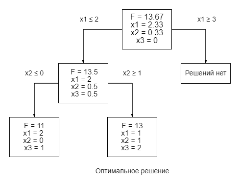

# branch-and-bound-method

### Bruteforce
|x1, x2, x3 | F | x1, x2, x3 | F | x1, x2, x3 | F | x1, x2, x3 | F |x1, x2, x3 | F |
|---|---|---|---|---|---|---|---|---|---|
| (0, 0, 0) |  0 | (0, 0, 4) |  4 | (0, 1, 2) |  8 | (1, 0, 1) |  6 | (1, 1, 1) |  12 |
| (0, 0, 1) | 1 | (0, 0, 5) |  5 | (0, 1, 3) |  9 | (1, 0, 2) | 7 | (1, 1, 2) |  13 |
| (0, 0, 2) |  2 | (0, 1, 0) |  6 | (0, 1, 4) |  10 | (1, 0, 3) | 8| (2, 0, 0) |  10 |
| (0, 0, 3) |  3 | (0, 1, 1) |  7 | (1, 0, 0) |  5 | (1, 1, 0) |  11 | (2, 0, 1) |  11 |

#### Best solve:  (1, 1, 2) F: 13

### Simplex - method
    Solve with branch and bound:
    Start solving task:
     5.00x1 + 6.00x2 + 1.00x3 ->  MAX
     2.00x1 + x2 + x3 <= 5.0
     x1 + 2.00x2 <= 3.0
     0.50x2 + x3 <= 8.0

Iteration 1
  |   |   x1   |   x2   |   x3   |   x4   |   x5   |   x6   |    b   |
|---|---|---|---|---|---|---|---|
  x4 |   2.00 |   1.00 |   1.00 |   1.00 |   0.00 |   0.00 |   5.00 |
  x5 |   1.00 |   2.00 |   0.00 |   0.00 |   1.00 |   0.00 |   3.00 |
  x6 |   0.00 |   0.50 |   1.00 |   0.00 |   0.00 |   1.00 |   8.00 |
   F |  -5.00 |  -6.00 |  -1.00 |   0.00 |   0.00 |   0.00 |   0.00 |
   x |   0.00 |   0.00 |   0.00 |   5.00 |   3.00 |   8.00 |

Iteration 2
    | |   x1   |   x2   |   x3   |   x4   |   x5   |   x6   |    b   |
|---|---|---|---|---|---|---|---|   
  x4 |   1.50 |   0.00 |   1.00 |   1.00 |  -0.50 |   0.00 |   3.50 |
  x2 |   0.50 |   1.00 |   0.00 |   0.00 |   0.50 |   0.00 |   1.50 |
  x6 |  -0.25 |   0.00 |   1.00 |   0.00 |  -0.25 |   1.00 |   7.25 |
   F |  -2.00 |   0.00 |  -1.00 |   0.00 |   3.00 |   0.00 |   9.00 |
   x |   0.00 |   1.50 |   0.00 |   3.50 |   0.00 |   7.25 |

Iteration 3
   | |   x1   |   x2   |   x3   |   x4   |   x5   |   x6   |    b   |
|---|---|---|---|---|---|---|---|
  x1 |   1.00 |   0.00 |   0.67 |   0.67 |  -0.33 |   0.00 |   2.33 |
  x2 |   0.00 |   1.00 |  -0.33 |  -0.33 |   0.67 |   0.00 |   0.33 |
  x6 |   0.00 |   0.00 |   1.17 |   0.17 |  -0.33 |   1.00 |   7.83 |
   F |   0.00 |   0.00 |   0.33 |   1.33 |   2.33 |   0.00 |  13.67 |
   x |   2.33 |   0.33 |   0.00 |   0.00 |   0.00 |   7.83 |
   
 #### Solve: [2.33333333 0.33333333 0.        ] , F: 13.666666666666668 

### Branch and bound method

    Divide to tasks: x1 <= 2.000 and x1 >= 3.000
    Start solving task:
     5.00x1 + 6.00x2 + 1.00x3 ->  MAX
     2.00x1 + x2 + x3 <= 5.0
     x1 + 2.00x2 <= 3.0
     0.50x2 + x3 <= 8.0
     x1 <= 2.0

Iteration 1
  |  |   x1   |   x2   |   x3   |   x4   |   x5   |   x6   |   x7   |    b   |
|---|---|---|---|---|---|---|---|---|
  x4 |   2.00 |   1.00 |   1.00 |   1.00 |   0.00 |   0.00 |   0.00 |   5.00 |
  x5 |   1.00 |   2.00 |   0.00 |   0.00 |   1.00 |   0.00 |   0.00 |   3.00 |
  x6 |   0.00 |   0.50 |   1.00 |   0.00 |   0.00 |   1.00 |   0.00 |   8.00 |
  x7 |   1.00 |   0.00 |   0.00 |   0.00 |   0.00 |   0.00 |   0.00 |   2.00 |
   F |  -5.00 |  -6.00 |  -1.00 |   0.00 |   0.00 |   0.00 |   0.00 |   0.00 |
   x |   0.00 |   0.00 |   0.00 |   5.00 |   3.00 |   8.00 |   2.00 |

Iteration 4
  |   |   x1   |   x2   |   x3   |   x4   |   x5   |   x6   |   x7   |    b   |
|---|---|---|---|---|---|---|---|---|
  x3 |   0.00 |   0.00 |   1.00 |   1.00 |  -0.50 |   0.00 |   0.00 |   0.50 |
  x2 |   0.00 |   1.00 |   0.00 |   0.00 |   0.50 |   0.00 |   0.00 |   0.50 |
  x6 |   0.00 |   0.00 |   0.00 |  -1.00 |   0.25 |   1.00 |   0.00 |   7.25 |
  x1 |   1.00 |   0.00 |   0.00 |   0.00 |   0.00 |   0.00 |   0.00 |   2.00 |
   F |   0.00 |   0.00 |   0.00 |   1.00 |   2.50 |   0.00 |   0.00 |  13.50 |
   x |   2.00 |   0.50 |   0.50 |   0.00 |   0.00 |   7.25 |   0.00 |
     
####  Solve: [2.  0.5 0.5] , F: 13.5 

     Divide to tasks: x2 <= 0.000 and x2 >= 1.000
        Start solving task:
         5.00x1 + 6.00x2 + 1.00x3 ->  MAX
         2.00x1 + x2 + x3 <= 5.0
         x1 + 2.00x2 <= 3.0
         0.50x2 + x3 <= 8.0
         x1 <= 2.0
         x2 <= 0.0

Iteration 1
  |  |   x1   |   x2   |   x3   |   x4   |   x5   |   x6   |   x7   |   x8   |    b   |
|---|---|---|---|---|---|---|---|---|---|
  x4 |   2.00 |   1.00 |   1.00 |   1.00 |   0.00 |   0.00 |   0.00 |   0.00 |   5.00 |
  x5 |   1.00 |   2.00 |   0.00 |   0.00 |   1.00 |   0.00 |   0.00 |   0.00 |   3.00 |
  x6 |   0.00 |   0.50 |   1.00 |   0.00 |   0.00 |   1.00 |   0.00 |   0.00 |   8.00 |
  x7 |   1.00 |   0.00 |   0.00 |   0.00 |   0.00 |   0.00 |   0.00 |   0.00 |   2.00 |
  x8 |   0.00 |   1.00 |   0.00 |   0.00 |   0.00 |   0.00 |   0.00 |   0.00 |   0.00 |
   F |  -5.00 |  -6.00 |  -1.00 |   0.00 |   0.00 |   0.00 |   0.00 |   0.00 |   0.00 |
   x |   0.00 |   0.00 |   0.00 |   5.00 |   3.00 |   8.00 |   2.00 |   0.00 |

Iteration 4
  |  |   x1   |   x2   |   x3   |   x4   |   x5   |   x6   |   x7   |   x8   |    b   |
|---|---|---|---|---|---|---|---|---|---|
  x3 |   0.00 |   0.00 |   1.00 |   1.00 |   0.00 |   0.00 |   0.00 |   0.00 |   1.00 |
  x5 |   0.00 |   0.00 |   0.00 |   0.00 |   1.00 |   0.00 |   0.00 |   0.00 |   1.00 |
  x6 |   0.00 |   0.00 |   0.00 |  -1.00 |   0.00 |   1.00 |   0.00 |   0.00 |   7.00 |
  x1 |   1.00 |   0.00 |   0.00 |   0.00 |   0.00 |   0.00 |   0.00 |   0.00 |   2.00 |
  x2 |   0.00 |   1.00 |   0.00 |   0.00 |   0.00 |   0.00 |   0.00 |   0.00 |   0.00 |
   F |   0.00 |   0.00 |   0.00 |   1.00 |   0.00 |   0.00 |   0.00 |   0.00 |  11.00 |
   x |   2.00 |   0.00 |   1.00 |   0.00 |   1.00 |   7.00 |   0.00 |   0.00 |
         
 #### Solve: [2. 0. 1.] , F: 11.0 

        Start solving task:
         5.00x1 + 6.00x2 + 1.00x3 ->  MAX
         2.00x1 + x2 + x3 <= 5.0
         x1 + 2.00x2 <= 3.0
         0.50x2 + x3 <= 8.0
         x1 <= 2.0
         -x2 <= -1.0

Iteration 0
 |   |   x1   |   x2   |   x3   |   x4   |   x5   |   x6   |   x7   |   x8   |    b   |
|---|---|---|---|---|---|---|---|---|---|
  x4 |   2.00 |   1.00 |   1.00 |   1.00 |   0.00 |   0.00 |   0.00 |   0.00 |   5.00 |
  x5 |   1.00 |   2.00 |   0.00 |   0.00 |   1.00 |   0.00 |   0.00 |   0.00 |   3.00 |
  x6 |   0.00 |   0.50 |   1.00 |   0.00 |   0.00 |   1.00 |   0.00 |   0.00 |   8.00 |
  x7 |   1.00 |   0.00 |   0.00 |   0.00 |   0.00 |   0.00 |   0.00 |   0.00 |   2.00 |
  x8 |   0.00 |  -1.00 |   0.00 |   0.00 |   0.00 |   0.00 |   0.00 |   0.00 |  -1.00 |
   F |  -5.00 |  -6.00 |  -1.00 |   0.00 |   0.00 |   0.00 |   0.00 |   0.00 |   0.00 |
   x |   0.00 |   0.00 |   0.00 |   5.00 |   3.00 |   8.00 |   2.00 |  -1.00 |

Iteration 3
 |   |   x1   |   x2   |   x3   |   x4   |   x5   |   x6   |   x7   |   x8   |    b   |
|---|---|---|---|---|---|---|---|---|---|
  x3 |   0.00 |   0.00 |   1.00 |   1.00 |  -2.00 |   0.00 |   0.00 |   0.00 |   2.00 |
  x1 |   1.00 |   0.00 |   0.00 |   0.00 |   1.00 |   0.00 |   0.00 |   0.00 |   1.00 |
  x6 |   0.00 |   0.00 |   0.00 |  -1.00 |   2.00 |   1.00 |   0.00 |   0.00 |   5.50 |
  x7 |   0.00 |   0.00 |   0.00 |   0.00 |  -1.00 |   0.00 |   0.00 |   0.00 |   1.00 |
  x2 |   0.00 |   1.00 |   0.00 |   0.00 |   0.00 |   0.00 |   0.00 |   0.00 |   1.00 |
   F |   0.00 |   0.00 |   0.00 |   1.00 |   3.00 |   0.00 |   0.00 |   0.00 |  13.00 |
   x |   1.00 |   1.00 |   2.00 |   0.00 |   0.00 |   5.50 |   1.00 |   0.00 |
        
####  Solve: [1. 1. 2.] , F: 13.0 

    
    Start solving task:
     5.00x1 + 6.00x2 + 1.00x3 ->  MAX
     2.00x1 + x2 + x3 <= 5.0
     x1 + 2.00x2 <= 3.0
     0.50x2 + x3 <= 8.0
     -x1 <= -3.0

Iteration 0
   |  |   x1   |   x2   |   x3   |   x4   |   x5   |   x6   |   x7   |    b   |
 |---|---|---|---|---|---|---|---|---|
  x4 |   2.00 |   1.00 |   1.00 |   1.00 |   0.00 |   0.00 |   0.00 |   5.00 |
  x5 |   1.00 |   2.00 |   0.00 |   0.00 |   1.00 |   0.00 |   0.00 |   3.00 |
  x6 |   0.00 |   0.50 |   1.00 |   0.00 |   0.00 |   1.00 |   0.00 |   8.00 |
  x7 |  -1.00 |   0.00 |   0.00 |   0.00 |   0.00 |   0.00 |   0.00 |  -3.00 |
   F |  -5.00 |  -6.00 |  -1.00 |   0.00 |   0.00 |   0.00 |   0.00 |   0.00 |
   x |   0.00 |   0.00 |   0.00 |   5.00 |   3.00 |   8.00 |  -3.00 |
     
####  Solve does not exist

### Best solve:  [1. 1. 2.] F: 13.0
